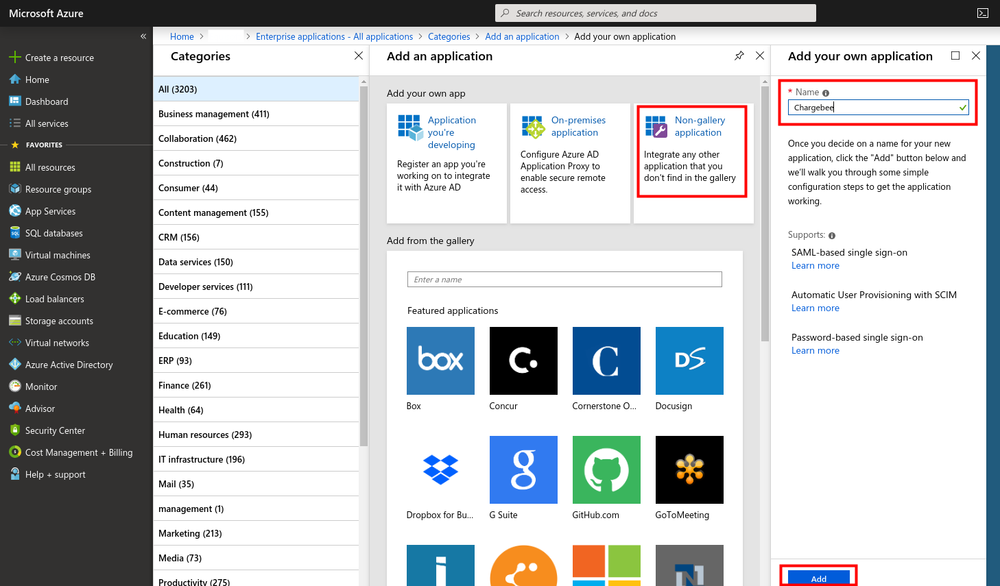

## Setup Chargebee SSO with Azure AD

1. Login to the [Azure Portal](https://portal.azure.com/) 
2. Reach the [Enterprise applications](https://portal.azure.com/#blade/Microsoft_AAD_IAM/StartboardApplicationsMenuBlade/AllApps/menuId/) page

3. Create a "New application"

4. Select "Non-gallery application", name and add your application. 

5. Go in the "Single sign-on" settings and click "SAML"

6. Set the "Basic SAML Configuration":
  - Identifier (Entity ID) is your Chargebee subdomain (`https://<domain>.chargebee.com/`)
  - Set Reply URL (Assertion Consumer Service URL) to the following: `https://app.chargebee.com/saml/<domain>/acs`

7. Get the "Login URL" and download the "Certificate"

8. Connect to your [Chargebee](https://app.chargebee.com) account 
9. Reach the SAML settings

10. Fill the SAML configuration
  - Paste "Login URL" from the Azure application page.
  - Paste contents from downloaded Certificate (Base64) in the Chargebee "SAML Certificate" text box
  - Click "Confirm"

11. In Azure, click "Users and groups" to allow users to login to the Chargebee application

